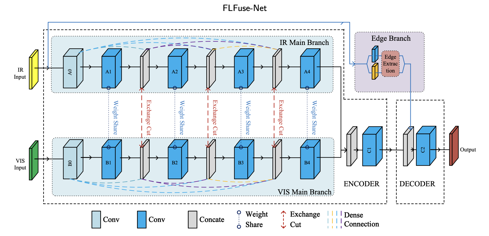
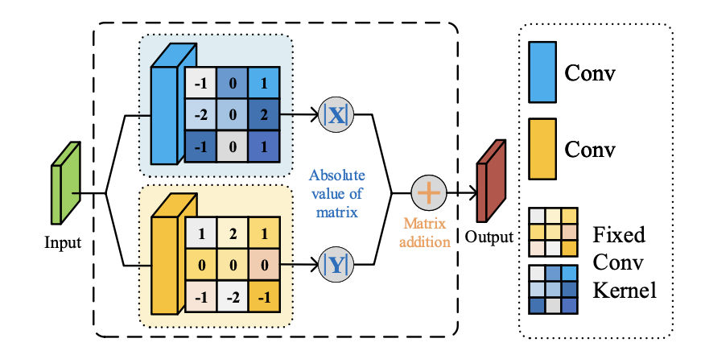

# The code of paper 'FLFuse-Net: A Fast and Lightweight Infrared and Visible Image Fusion Network Via Feature Flow and Edge Compensation for Salient Information'.
Weimin Xue, Anhong Wang, Lijun Zhao, FLFuse-Net: A fast and lightweight infrared and visible image fusion network via feature flow and edge compensation for salient information, Infrared Physics & Technology, Volume 127, 2022, 104383, ISSN 1350-4495

# 2023.9.4 Update
1. Fixed the issues related to 'MyRandomCrop' in #1 and #2, and now the code does not require replacing the 'transform' file.
2. OpenCV library is used as the image reading library.

# Abstract: 
In this paper, a fast, lightweight image fusion network, FLFuse-Net, is proposed to generate a new perspective image with identical and discriminative features from both infrared and visible images. In this network, deep convolutional features are extracted and fused synchronously through feature flow, while the edge features of the salient targets from the infrared image are compensated asynchronously. First, we design an autoencoder network structure with cross-connections for simultaneous feature extraction and fusion. In this structure, the fusion strategy is carried out through feature flow rather than by using a fixed fusion strategy, as in previous works. Second, we propose an edge compensation branch for salient information with the corresponding edge loss function to obtain the edge features of salient information from infrared images. Third, our network is designed as a lightweight network with a small number of parameters and low computational complexity, resulting in lower hardware requirements and a faster calculation speed. The experimental results confirm that the proposed FLFuse-Net outperforms the state-of-the-art fusion methods in objective and subjective assessments with very few parameters, especially on the TNO Image Fusion and NIR Scenes datasets.
Keywords: Infrared and visible image fusion; Lightweight image fusion method; Deeplearning based image fusion

## Paper: 
https://doi.org/10.1016/j.infrared.2022.104383.
(https://www.sciencedirect.com/science/article/pii/S1350449522003644)

## Network Structure: 
### NET: 
### edge compensation branch: 

## Env
pytorch=1.8.0 python=3.7 

then pip the needed packages

## Run

### Folder and File Structure of Train and Test Data
#### TRAIN DATA
    ---- Train Data ROOT
        |--- DataSet
            |--- 00001_IR.png
            |--- 00001_VI.png
                ....

#### Test DATA
    ---- ./Dataset/DataSet
        |--- 0001_IR.png
        |--- 0001_VI.png
            ....

### Test
1. Edit the test data root in data_loader.py with testpath()
2. Run test.py

### Train
1. Use dataset at https://www.epfl.ch/labs/ivrl/research/downloads/rgb-nir-scene-dataset/. Make dateset and edit the 'args.train_path' in main.py
2. Set run Parameters in main.py
4. Run main.py
